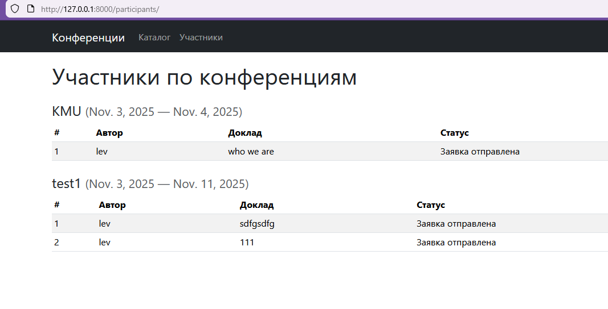

# Лабораторная работа № 2

РЕАЛИЗАЦИЯ ПРОСТОГО САЙТА СРЕДСТВАМИ DJANGO

- Цель: овладеть практическими навыками и умениями реализации web-сервисов средствами Django 2.2.
- Оборудование: компьютерный класс.
- Программное обеспечение: Python 3.6+, Django 3, PostgreSQL *.
- Практическое задание:
Реализовать сайт используя фреймворк Django 3 и СУБД PostgreSQL *, в соответствии с вариантом задания лабораторной работы.

### Тема работы
`Список научных конференций`

Интерфейс описывает названия конференций, список тематик, место проведения,
период проведения, описание конференций, описание место проведения, условия участия.
Необходимо реализовать следующий функционал:
- Регистрация новых пользователей.
- Просмотр конференций и регистрацию авторов для выступлений.
Пользователь должен иметь возможность редактирования и удаления своих
регистраций.
- Написание отзывов к конференциям. При добавлении комментариев,
должны сохраняться даты конференции, текст комментария, рейтинг (1-10),
информация о комментаторе.
- Администратор должен иметь возможность указания результатов
выступления (рекомендован к публикации или нет) средствами Django-
admin.
- В клиентской части должна формироваться таблица, отображающая всех
участников по конференциям.

### Выполнение работы:

Главная страница отображает список конференций и даты проведения каждой

Для каждой конференции можно посмотреть список докладов и отзывы

Для каждой конфереции можно посмотреть список участников-докладчиков

При авторизации и выходе из аккаунта происходит переадресация на главную страницу

Программная реализация доступна по [ссылке](https://github.com/MrL013/TonikX-ITMO_ICT_WebDevelopment_2025-2026/tree/main/students/k3340/Sinyukov_Lev/Lr_2/confsite)