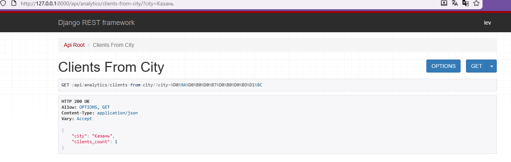

# Лабораторная работа № 3

РЕАЛИЗАЦИЯ СЕРВЕРНОЙ ЧАСТИ ПРИЛОЖЕНИЯ СРЕДСТВАМИ DJANGO И DJANGORESTFRAMEWORK
- Цель: овладеть практическими навыками и умениями реализации web-сервисов средствами Django.
- Оборудование: компьютерный класс.
- Программное обеспечение: Python 3.6+, Django 3, PostgreSQL *, Django REST Framework (DRF),
- Практическое задание:
Реализовать сайт, используя фреймворк Django 3, Django REST Framework, Djoser и СУБД PostgreSQL *, в соответствии с вариантом задания лабораторной работы.

### Тема работы
`Администрирование гостиницы`

Создать программную систему, предназначенную для администратора гостиницы.
Такая система должна обеспечивать хранение сведений об имеющихся в гостинице
номерах, о проживающих в гостинице клиентах и о служащих, убирающихся в номерах.
Количество номеров в гостинице известно, и имеются номера трех типов: одноместный,
двухместный и трехместный, отличающиеся стоимостью проживания в сутки. В каждом
номере есть телефон.
О каждом проживающем должна храниться следующая информация: номер
паспорта, фамилия, имя, отчество, город, из которого он прибыл, дата поселения в
гостинице, выделенный гостиничный номер.
О служащих гостиницы должна быть известна информация следующего содержания:
фамилия, имя, отчество, где (этаж) и когда (день недели) он убирает. Служащий
гостиницы убирает все номера на одном этаже в определенные дни недели, при этом в
разные дни он может убирать разные этажи.
Работа с системой предполагает получение следующей информации:

- о клиентах, проживавших в заданном номере, в заданный период времени;
- о количестве клиентов, прибывших из заданного города,
- о том, кто из служащих убирал номер указанного клиента в заданный день недели,
- сколько в гостинице свободных номеров;
- список клиентов с указанием места жительства, которые проживали в те же дни,
что и заданный клиент, в определенный период времени.
Администратор должен иметь возможность выполнить следующие операции:
- принять на работу или уволить служащего гостиницы;
- изменить расписание работы служащего;
- поселить или выселить клиента.
Необходимо предусмотреть также возможность автоматической выдачи отчета о
работе гостиницы за указанный квартал текущего года. Такой отчет должен содержать
следующие сведения:
- число клиентов за указанный период в каждом номере;
- количество номеров не каждом этаже;
- общая сумма дохода за каждый номер;
- суммарный доход по всей гостинице.


### Выполнение работы:

`ERD`


Примеры GET запросов




`Сериализатор`

```python
from rest_framework import serializers
from .models import Room, Client, Stay, Employee, CleaningSchedule


class RoomSerializer(serializers.ModelSerializer):
    class Meta:
        model = Room
        fields = "__all__"


class ClientSerializer(serializers.ModelSerializer):
    class Meta:
        model = Client
        fields = "__all__"


class StaySerializer(serializers.ModelSerializer):
    class Meta:
        model = Stay
        fields = "__all__"


class EmployeeSerializer(serializers.ModelSerializer):
    class Meta:
        model = Employee
        fields = "__all__"


class CleaningScheduleSerializer(serializers.ModelSerializer):
    class Meta:
        model = CleaningSchedule
        fields = "__all__"


class StayShortSerializer(serializers.ModelSerializer):
    room_number = serializers.IntegerField(source="room.number", read_only=True)

    class Meta:
        model = Stay
        fields = ["id", "check_in", "check_out", "room_number"]


class ClientDetailSerializer(serializers.ModelSerializer):
    stays = StayShortSerializer(many=True, read_only=True)

    class Meta:
        model = Client
        fields = "__all__"


class ClientShortSerializer(serializers.ModelSerializer):
    class Meta:
        model = Client
        fields = ["id", "passport_number", "last_name", "first_name"]


class RoomDetailSerializer(serializers.ModelSerializer):
    stays = serializers.SerializerMethodField()

    def get_stays(self, obj):
        stays = obj.stays.select_related("client")
        return [
            {
                "id": s.id,
                "check_in": s.check_in,
                "check_out": s.check_out,
                "client": ClientShortSerializer(s.client).data,
            }
            for s in stays
        ]

    class Meta:
        model = Room
        fields = "__all__"


Программная реализация доступна по [ссылке](https://github.com/MrL013/TonikX-ITMO_ICT_WebDevelopment_2025-2026/tree/main/students/k3340/Sinyukov_Lev/Lr_3/)