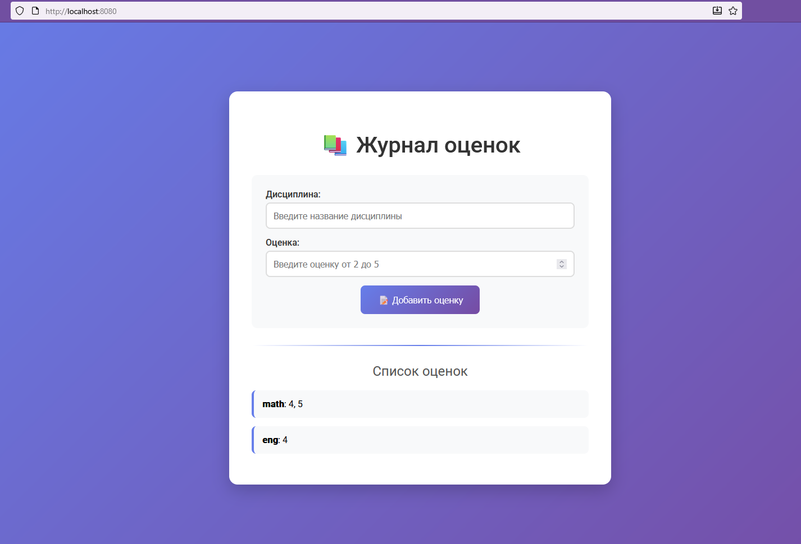

# Лабораторная работа № 1

For full documentation visit [mkdocs.org](https://www.mkdocs.org).

## Задание 1:

Реализовать клиентскую и серверную часть приложения. Клиент отправляет серверу сообщение «Hello, server», и оно должно отобразиться на стороне сервера. В ответ сервер отправляет клиенту сообщение «Hello, client», которое должно отобразиться у клиента.

Требования:

    Обязательно использовать библиотеку socket.
    Реализовать с помощью протокола UDP.

Полезные ссылки:

* [Habr: Основы работы с сокетами](https://habr.com/ru/post/149077/)
* [Андрей Малинин: Сокеты в Python](https://andreymal.org/socket3/)
* [Документация Python: Руководство по сокетам](https://docs.python.org/3.6/howto/sockets.html)
* [Python Library Reference: socket](https://docs.python.org/3.6/library/socket.html)
* [Видео: Введение в работу с сокетами](https://www.youtube.com/watch?v=Lbfe3-v7yE0)

`server.py`:
```python
import socket

# Параметры сервера
HOST = 'localhost'  # Адрес хоста (localhost для локальных соединений)
PORT = 8080         # Порт, на котором будет работать сервер

# Создаем сокет
server_socket = socket.socket(socket.AF_INET, socket.SOCK_DGRAM)

# Привязываем сокет к адресу и порту
server_socket.bind((HOST, PORT))

print(f"UDP сервер запущен на {HOST}:{PORT}...")

while True:
    # Принимаем соединение, запрос от клиента
    request, client_address = server_socket.recvfrom(1024)
    print(f'Подключение от {client_address}')
    print(f'Запрос клиента:\n{request.decode("utf-8")}')

    response = 'Hello, client'

    # Отправляем ответ клиенту
    server_socket.sendto(response.encode("utf-8"), client_address)
```
 `client.py`:
```python
import socket

server_address = ('localhost', 8080)

# Создаем сокет
client_socket = socket.socket(socket.AF_INET, socket.SOCK_DGRAM)

# Отправляем сообщение серверу
client_socket.sendto("Hello, server".encode("utf-8"), server_address)

# Получаем ответ от сервера
data, _ = client_socket.recvfrom(1024)
print(f'Ответ от сервера: {data.decode("utf-8")}')

client_socket.close()
```

## Задание 2:

Реализовать клиентскую и серверную часть приложения. Клиент запрашивает выполнение математической операции, параметры которой вводятся с клавиатуры. Сервер обрабатывает данные и возвращает результат клиенту.

Варианты операций:

    Теорема Пифагора.
    Решение квадратного уравнения.
    Поиск площади трапеции.
    Поиск площади параллелограмма.

Порядок выбора варианта: Выбирается по порядковому номеру в журнале (пятый студент получает вариант 1 и т.д.).

Требования:

    Обязательно использовать библиотеку socket.
    Реализовать с помощью протокола TCP.

`server.py`:
```python
import socket

def trapezoid_product(a, b, height):
    return ((a + b)/ 2) * height

# Параметры сервера
HOST = 'localhost'  # Адрес хоста (localhost для локальных соединений)
PORT = 8080         # Порт, на котором будет работать сервер

# Создаем сокет
server_socket = socket.socket(socket.AF_INET, socket.SOCK_STREAM)

# Привязываем сокет к адресу и порту
server_socket.bind((HOST, PORT))

# Начинаем слушать входящие соединения
server_socket.listen(5)
print(f"сервер запущен на {HOST}:{PORT}...")

while True:
    # Принимаем соединение от клиента
    client_connection, client_address = server_socket.accept()
    print(f'Подключение от {client_address}')

    first_request = '''
    Введите длины оснований и высоты через пробел без запятой в формате <a, b, h>, где a, b - длины оснований, h - высота
    '''

    # Отправляем ответ клиенту
    client_connection.sendall(first_request.encode('utf-8'))

    # Получаем запрос от клиента
    data_request = client_connection.recv(1024).decode('utf-8')
    print(f'Полученные данные:\n{data_request}')

    try:
        res = trapezoid_product(*list(map(float, data_request.split())))
    except ValueError:
        client_connection.sendall("Неверный формат входных данных. Подключитесь повторно и попробуйте снова".encode('utf-8'))
        client_connection.close()
        continue

    # Отправляем ответ клиенту
    client_connection.sendall(str(res).encode('utf-8'))

    client_connection.close()
```
 `client.py`:
```python
import socket

# Создаем сокет
client_socket = socket.socket(socket.AF_INET, socket.SOCK_STREAM)

# Подключаемся к серверу
client_socket.connect(('localhost', 8080))

# Получаем ответ от сервера
first_response = client_socket.recv(1024)
print(first_response.decode('utf-8'))

input_data = input('Введите данные: ')
# Отправляем сообщение серверу
client_socket.sendall(input_data.encode('utf-8'))

response = client_socket.recv(1024)

print(response.decode('utf-8'))
# Закрываем соединение
client_socket.close()
```

## Задание 3:

Реализовать серверную часть приложения. Клиент подключается к серверу, и в ответ получает HTTP-сообщение, содержащее HTML-страницу, которая сервер подгружает из файла index.html.

Полезные ссылки:

* [ZetCode: Работа с сокетами](http://zetcode.com/python/socket/)

Требования:

    Обязательно использовать библиотеку socket.

`server.py`:
```python
import socket

try:
    with open('index.html', 'r') as file:
        index_html = file.read()
except FileNotFoundError:
    index_html = '<h1>Error: file not found</h1>'
# Параметры сервера
HOST = 'localhost'  # Адрес хоста (localhost для локальных соединений)
PORT = 8080         # Порт, на котором будет работать сервер

# Создаем сокет
server_socket = socket.socket(socket.AF_INET, socket.SOCK_STREAM)

# Привязываем сокет к адресу и порту
server_socket.bind((HOST, PORT))

# Начинаем слушать входящие соединения
server_socket.listen(5)
print(f"HTTP сервер запущен на {HOST}:{PORT}...")

while True:
    # Принимаем соединение от клиента
    client_connection, client_address = server_socket.accept()
    print(f'Подключение от {client_address}')

    # Формируем HTTP-ответ с заголовками и HTML-контентом
    http_response = (
            "HTTP/1.1 200 OK\r\n"
            "Content-Type: text/html; charset=UTF-8\r\n"
            f"Content-Length: {len(index_html)}\r\n"
            "Connection: close\r\n"
            "\r\n"
            + index_html
    )

    # Отправляем ответ клиенту
    client_connection.sendall(http_response.encode('utf-8'))


    client_connection.close()
```
 `client.py`:
```python
import socket

# Создаем сокет
client_socket = socket.socket(socket.AF_INET, socket.SOCK_STREAM)

# Подключаемся к серверу
client_socket.connect(('localhost', 8080))

# Получаем ответ от сервера
response =  b""
while True:
    part_response = client_socket.recv(1024)
    if not part_response:
        break
    response += part_response

print(f'Ответ от сервера: {response.decode()}')
# Закрываем соединение
client_socket.close()
```

`index.html`:
```html
<!DOCTYPE html>
<html lang="en">
<head>
    <meta charset="UTF-8">
    <title>Task3</title>
</head>
<body>
Here must be something...
</body>
</html>
```

## Задание 4:

Реализовать двухпользовательский или многопользовательский чат. Для максимального количества баллов реализуйте многопользовательский чат.

Требования:

    Обязательно использовать библиотеку socket.
    Для многопользовательского чата необходимо использовать библиотеку threading.

Реализация:

    Протокол TCP: 100% баллов.
    Протокол UDP: 80% баллов.
    Для UDP используйте threading для получения сообщений на клиенте.
    Для TCP запустите клиентские подключения и обработку сообщений от всех пользователей в потоках. Не забудьте сохранять пользователей, чтобы отправлять им сообщения.

Полезные ссылки:
* [Документация Python: threading](https://docs.python.org/3/library/threading.html) 
* [WebDevBlog: Введение в потоки Python](https://docs.python.org/3/library/threading.html)

`server.py`:
```python
import socket
import threading

def broadcast(msg, socket_sender):
    for client in clients:
        if client != socket_sender:
            try:
                client.send(msg)
            except:
                clients.remove(client)

def handle_client(client_socket, client_address):
    print(f'Подключение от {client_address}')

    while True:
        try:
            message = client_socket.recv(1024)
            if not message:
                break
            print(f'Запрос клиента {client_address}:\n{message.decode("utf-8")}')
            broadcast(message, client_socket)
        except:
            break

    print(f'Прервано соединение с {client_address}')
    clients.remove(client_address)
    client_socket.close()

def func_server():
    server = socket.socket(socket.AF_INET, socket.SOCK_STREAM)
    server.bind((HOST, PORT))
    server.listen()
    print(f"Сервер запущен на {HOST}:{PORT}...")

    while True:
        client_socket, client_address = server.accept()
        clients.append(client_socket)
        thread = threading.Thread(target=handle_client, args=(client_socket, client_address))
        thread.start()


HOST = 'localhost'
PORT = 8080

clients = []

func_server()
```

`client.py`:
```python
import socket
import threading

def recieve_message(client_sock):
    while True:
        try:
            message = client_sock.recv(1024).decode("utf-8")
            if message:
                print(message)
        except:
            print('No server connection')
            client_sock.close()
            break

def func_client():
    client_socket = socket.socket(socket.AF_INET, socket.SOCK_STREAM)
    client_socket.connect((HOST, PORT))

    thread = threading.Thread(target=recieve_message, args=(client_socket,))
    thread.start()

    while True:
        message = input()
        client_socket.send(message.encode("utf-8"))

HOST = 'localhost'
PORT = 8080

func_client()
```

## Задание 5:

Написать простой веб-сервер для обработки GET и POST HTTP-запросов с помощью библиотеки socket в Python.

Задание:

    Сервер должен:
        Принять и записать информацию о дисциплине и оценке по дисциплине.
        Отдать информацию обо всех оценках по дисциплинам в виде HTML-страницы.

Полезные ссылки:

* [Базовый класс для веб-сервера](https://docs.google.com/document/d/1lv_3D9VtMxz8tNkA6rA1xu9zaWEIBGXiLWBo1cse-0k/edit?usp=sharing)
* [Мануал по созданию сервера](https://iximiuz.com/ru/posts/writing-python-web-server-part-3/)

`server.py`:
```python
import socket
# import sys
from urllib.parse import parse_qs, unquote, urlparse


class MyHTTPServer:
    def __init__(self, host, port, server_name):
        self.host = host
        self.port = port
        self.server_name = server_name
        self.grades = {}  # Словарь для хранения оценок

    def serve_forever(self):
        # Запуск сервера на сокете, обработка входящих соединений
        server_socket = socket.socket(socket.AF_INET, socket.SOCK_STREAM)
        server_socket.setsockopt(socket.SOL_SOCKET, socket.SO_REUSEADDR, 1)
        server_socket.bind((self.host, self.port))
        server_socket.listen(5)

        print(f"Сервер {self.server_name} запущен на {self.host}:{self.port}")

        try:
            while True:
                client_socket, addr = server_socket.accept()
                print(f"Подключен клиент: {addr}")
                self.serve_client(client_socket)
        except KeyboardInterrupt:
            print("\nСервер остановлен")
        finally:
            server_socket.close()

    def serve_client(self, client_socket):
        # Обработка подключения
        try:
            # Создаем объект из сокета для построчного чтения
            client_file = client_socket.makefile('rwb', buffering=0)

            # Парсим HTTP запрос
            method, url, params, headers, body = self.parse_request(client_file)

            # Обрабатываем запрос
            response, status_code = self.handle_request(method, url, params, headers, body)

            # Отправляем ответ
            self.send_response(client_socket, response, status_code)

        except Exception as e:
            print(f"Ошибка при обработке клиента: {e}")
            # В случае ошибки отправляем 500 Internal Server Error
            error_html = "<html><body><h1>500 Internal Server Error</h1></body></html>"
            self.send_response(client_socket, error_html, 500)
        finally:
            client_socket.close()

    def parse_request(self, client_file):
        # Обработка заголовка HTTP запроса
        request_line = client_file.readline().decode('utf-8').strip()
        if not request_line:
            raise ValueError("Пустой запрос")

        # Разбиваем на метод, URL и версию протокола
        method, url, version = request_line.split()
        print(f"Запрос: {method} {url} {version}")

        # Парсим URL и параметры
        parsed_url = urlparse(url)
        path = parsed_url.path
        query_params = parse_qs(parsed_url.query)

        # Обработка headers
        headers = {}
        while True:
            header_line = client_file.readline().decode('utf-8').strip()
            if not header_line:  # Пустая строка - конец заголовка
                break
            if ':' in header_line:
                key, value = header_line.split(':', 1)
                headers[key.strip()] = value.strip()

        # Читаем тело запроса для POST
        body = ""
        if method == 'POST' and 'Content-Length' in headers:
            content_length = int(headers['Content-Length'])
            body = client_file.read(content_length).decode('utf-8')

        return method, path, query_params, headers, body

    def handle_request(self, method, url, params, headers, body):
        # Обработка url в соответствии с нужным методом
        if url == '/' or url == '/grades':
            if method == 'GET':
                return self.handle_get_grades(), 200
            elif method == 'POST':
                return self.handle_post_grade(body), 200
            else:
                return self.build_error_html("Method Not Allowed"), 405
        else:
            return self.build_error_html("Not Found"), 404

    def handle_get_grades(self):
        # Обработка GET запроса - возвращаем HTML с оценками
        html = self.build_html()
        return html

    def handle_post_grade(self, body):
        # Обработка POST запроса - добавляем новую оценку
        parsed_body = parse_qs(body)
        discipline = unquote(parsed_body.get('discipline', [''])[0])
        grade_str = parsed_body.get('grade', [''])[0]

        if discipline and grade_str:
            try:
                grade = int(grade_str)
                if 2 <= grade <= 5:
                    self.grades.setdefault(discipline, []).append(grade)
                    print(f"Добавлена оценка: {discipline} - {grade}")
            except ValueError:
                pass  # Некорректная оценка

        # После POST возвращаем ту же страницу с обновленными данными
        return self.build_html()

    def build_html(self):
        # Генерация HTML страницы
        html = """
            <!DOCTYPE html>
            <html lang="ru">
            <head>
                <meta charset="UTF-8">
                <title>Журнал оценок</title>
                <link href="https://fonts.googleapis.com/css2?family=Roboto:wght@300;400;500&display=swap" rel="stylesheet">
                <style>
                    body {
                        font-family: 'Roboto', sans-serif;
                        background: linear-gradient(135deg, #667eea 0%, #764ba2 100%);
                        margin: 0;
                        padding: 0;
                        min-height: 100vh;
                        display: flex;
                        justify-content: center;
                        align-items: center;
                    }
                    .container {
                        background: white;
                        padding: 40px;
                        border-radius: 15px;
                        box-shadow: 0 10px 30px rgba(0,0,0,0.2);
                        max-width: 600px;
                        width: 90%;
                        text-align: center;
                    }
                    h1 {
                        color: #333;
                        margin-bottom: 30px;
                        font-weight: 500;
                        font-size: 2.5em;
                    }
                    h2 {
                        color: #555;
                        margin-top: 30px;
                        margin-bottom: 20px;
                        font-weight: 400;
                    }
                    form {
                        background: #f8f9fa;
                        padding: 25px;
                        border-radius: 10px;
                        margin-bottom: 20px;
                    }
                    label {
                        display: block;
                        margin-bottom: 15px;
                        font-weight: 500;
                        color: #333;
                        text-align: left;
                    }
                    input {
                        width: 100%;
                        padding: 12px;
                        margin-top: 5px;
                        border: 2px solid #ddd;
                        border-radius: 8px;
                        font-size: 16px;
                        box-sizing: border-box;
                        transition: border-color 0.3s;
                    }
                    input:focus {
                        outline: none;
                        border-color: #667eea;
                    }
                    button {
                        background: linear-gradient(135deg, #667eea 0%, #764ba2 100%);
                        color: white;
                        border: none;
                        padding: 15px 30px;
                        border-radius: 8px;
                        font-size: 16px;
                        cursor: pointer;
                        transition: transform 0.2s;
                        font-weight: 500;
                    }
                    button:hover {
                        transform: translateY(-2px);
                    }
                    hr {
                        border: none;
                        height: 2px;
                        background: linear-gradient(90deg, transparent, #667eea, transparent);
                        margin: 30px 0;
                    }
                    .grade-item {
                        background: #f8f9fa;
                        margin: 15px 0;
                        padding: 15px;
                        border-radius: 8px;
                        border-left: 4px solid #667eea;
                        text-align: left;
                    }
                    .no-grades {
                        color: #666;
                        font-style: italic;
                        margin: 30px 0;
                    }
                    .subject-name {
                        color: #333;
                        font-weight: 500;
                        margin-bottom: 5px;
                    }
                    .grades-list {
                        color: #666;
                    }
                </style>
            </head>
            <body>
                <div class="container">
                    <h1>📚 Журнал оценок</h1>
                    <form method="POST" action="/">
                        <label>Дисциплина:
                            <input name="discipline" placeholder="Введите название дисциплины" required>
                        </label>
                        <label>Оценка:
                            <input name="grade" type="number" min="2" max="5" placeholder="Введите оценку от 2 до 5" required>
                        </label>
                        <button type="submit">📝 Добавить оценку</button>
                    </form>
                    <hr>
                    <h2>Список оценок</h2>
            """

        if self.grades:
            for subject, marks in self.grades.items():
                html += f'<div class="grade-item"><b>{subject}</b>: {", ".join(map(str, marks))}</div>'
        else:
            html += '<p>Пока нет оценок</p>'

        html += """
    </div>
</body>
</html>"""
        return html

    def build_error_html(self, message):
        # Генерация HTML страницы ошибки
        return f"""<!DOCTYPE html>
<html>
<head><title>Error</title></head>
<body>
    <h1>{message}</h1>
    <a href="/">Вернуться на главную</a>
</body>
</html>"""

    def send_response(self, client_socket, response, status_code=200):
        # Отправка ответа
        status_messages = {
            200: 'OK',
            404: 'Not Found',
            405: 'Method Not Allowed',
            500: 'Internal Server Error'
        }

        status_line = f"HTTP/1.1 {status_code} {status_messages.get(status_code, 'Unknown')}\r\n"
        headers = [
            "Content-Type: text/html; charset=utf-8",
            f"Content-Length: {len(response.encode('utf-8'))}",
            "Connection: close",
            ""
        ]

        response_data = status_line + "\r\n".join(headers) + "\r\n" + response
        client_socket.sendall(response_data.encode('utf-8'))


if __name__ == '__main__':
    host = 'localhost'
    port = 8080
    name = 'EvaluationSheet'

    serv = MyHTTPServer(host, port, name)
    try:
        serv.serve_forever()
    except KeyboardInterrupt:
        pass
```



Выполнение работы:

    Работа выполняется индивидуально.
    По результатам необходимо подготовить отчет в виде текстового документа.

Оценивание:

    Выполнение пунктов 1-4 и однопользовательского чата (без потоков) — 60% баллов.
    Выполнение пунктов 1-5 и многопользовательского чата (с потоками) — 100% баллов.
